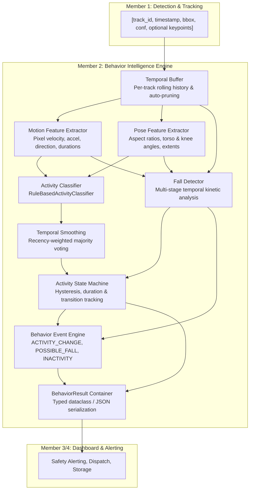

# Warehouse Sentinel - Behavior Intelligence Subsystem
**Member 2 Component | HackNex 2026**

Real-time human activity understanding, posture tracking, temporal state modeling, and safety event detection for automated warehouse video surveillance.

---

## 1. Overview & Purpose

The **Behavior Intelligence Subsystem** is Member 2's core component in the **Warehouse Sentinel** platform. Its sole responsibility is to translate low-level tracked person observations (`track_id`, timestamps, bounding boxes, detection confidences, and optional keypoint skeletons) into high-level, temporal human activity states, meaningful transitions, and safety events (e.g., slip-and-fall incidents, prolonged worker inactivity).

### Key Architectural Tenets
- **Completely Decoupled from Detection/Tracking**: Zero internal dependency on YOLO, ByteTrack, or GPU inference. Can run anywhere with lightweight CPU compute ($< 0.5$ ms per update).
- **Temporal Analysis**: No single-frame snap judgments. Behavior is understood across sliding temporal windows using true timestamps (supporting variable frame rates and dropped frames).
- **Explainable & Configurable**: 100% rule-based and deterministic baseline driven by YAML configuration—no magic numbers in code.
- **Graceful Degradation**: Operates on bounding-box kinematics alone when pose keypoints are missing or occluded.
- **Future ML Ready**: Base classifier interface enables drop-in replacement with LSTM/GRU/TCN models without modifying downstream consumers.

---

## 2. Pipeline Architecture



---

## 3. Contracts & API Interface

### Input Contract (Member 1 $\to$ Member 2)

Member 1 passes bounding boxes and optional 17-keypoint COCO poses per detected person.

#### Minimum Input (Motion-Only):
```python
result = behavior_engine.update(
    track_id=7,
    timestamp=12.4,                  # Monotonic seconds
    bbox=[100.0, 150.0, 160.0, 310.0], # [x1, y1, x2, y2]
    detection_confidence=0.94        # [0.0 - 1.0]
)
```

#### Preferred Input (Motion + Keypoint Pose):
```python
result = behavior_engine.update(
    track_id=7,
    timestamp=12.4,
    bbox=[100.0, 150.0, 160.0, 310.0],
    detection_confidence=0.94,
    keypoints=[
        [x0, y0, conf0],  # 0: nose
        [x1, y1, conf1],  # 1: left_eye
        # ... 17 COCO keypoints
        [x16, y16, conf16] # 16: right_ankle
    ]
)
```

---

### Output Contract (Member 2 $\to$ Member 3/4)

The engine returns a strongly typed `BehaviorResult` object (or structured JSON via `result.to_dict()`):

#### Standard Activity Observation
```json
{
  "track_id": 7,
  "timestamp": 12.4,
  "activity": "WALKING",
  "confidence": 0.92,
  "previous_activity": "STANDING",
  "duration": 4.8,
  "transition": {
    "from": "STANDING",
    "to": "WALKING",
    "timestamp": 12.4
  },
  "event": null
}
```

#### Fall Incident Alert
```json
{
  "track_id": 7,
  "timestamp": 52.7,
  "activity": "FALLING",
  "confidence": 0.94,
  "previous_activity": "WALKING",
  "duration": 0.0,
  "transition": {
    "from": "WALKING",
    "to": "FALLING",
    "timestamp": 52.7
  },
  "event": {
    "type": "POSSIBLE_FALL",
    "track_id": 7,
    "timestamp": 52.7,
    "confidence": 0.94,
    "severity": "HIGH",
    "reason": [
      "rapid downward movement (60.0 px/s >= 40.0)",
      "impact acceleration spike (600.0 px/s² >= 30.0)",
      "posture transition to horizontal",
      "low post-fall movement"
    ],
    "details": {
      "max_downward_velocity": 60.0,
      "max_acceleration": 600.0,
      "aspect_ratio_change": 2.45,
      "post_fall_velocity": 2.1,
      "composite_fall_score": 0.94
    }
  }
}
```

---

## 4. Activity Classes & Classification Logic

| Activity | Kinematic & Posture Profile | Key Discriminators |
| :--- | :--- | :--- |
| `STANDING` | Upright posture ($W/H < 0.75$, torso angle $< 35^\circ$), low velocity ($\le 8$ px/s). | Distinguishable from sitting via straight knee angle ($> 135^\circ$). |
| `WALKING` | Upright posture, moderate velocity ($6 - 28$ px/s). | Continuous directional displacement. |
| `RUNNING` | Upright posture, high velocity ($> 26$ px/s), acceleration bursts ($> 15$ px/s²). | Sustained high pixel velocity and higher trajectory variance. |
| `SITTING` | Upright torso ($< 35^\circ$), bent knees ($< 135^\circ$), low velocity ($\le 8$ px/s). | Lower hip vertical position at chair height. |
| `CROUCHING` | Low velocity, deep knee flexion ($< 115^\circ$), hips dropped low close to ankles ($< 0.35$ body height). | Squatting posture, distinguishing from sitting by hip height near ground. |
| `BENDING` | Low velocity, forward-tilted torso ($35^\circ - 75^\circ$ from vertical), straight legs ($> 130^\circ$). | Stooping at the waist for lifting/inspection while standing on feet. |
| `LYING` | Horizontal body orientation ($W/H > 1.15$, torso angle $> 60^\circ$), low velocity ($\le 6$ px/s). | Wide aspect ratio without rapid downward descent. |
| `FALLING` | Standing/Walking $\to$ downward velocity spike $\to$ impact $\to$ horizontal stillness. | Multi-stage temporal sequence detected by FallDetector. |
| `UNKNOWN` | Low detection confidence ($< 0.45$), occlusion, or ambiguous cues. | Prevents false positives under degraded sensor quality. |

---

## 4.1 Normal vs. Abnormal Intelligence Layer (`behavior/normality.py`)

Activities themselves are not inherently abnormal. The system translates recognized activities and temporal context into explainable normality statuses:

```text
STANDING   → NORMAL (Severity: NONE)
WALKING    → NORMAL (Severity: NONE)
RUNNING    → NORMAL (Severity: NONE)
SITTING    → NORMAL (Severity: NONE)
CROUCHING  → NORMAL (if duration <= 30s) / POTENTIALLY_UNUSUAL (if > 30s, Severity: LOW)
BENDING    → NORMAL (if duration <= 30s) / POTENTIALLY_UNUSUAL (if > 30s, Severity: LOW)
LYING      → NORMAL (if duration <= 30s) / POTENTIALLY_UNUSUAL (if > 30s, Severity: LOW)
FALLING    → ABNORMAL (Severity: HIGH, Reason: "Possible fall detected")
FALLING → LYING → ABNORMAL (Severity: HIGH, Reason: "Lying following a fall")
UNKNOWN    → UNKNOWN (Severity: NONE)
```

Structured output per person:
```json
{
  "track_id": 7,
  "activity": "BENDING",
  "status": "POTENTIALLY_UNUSUAL",
  "severity": "LOW",
  "confidence": 0.92,
  "reason": "Prolonged bending"
}
```

---

## 5. Temporal Buffer & Kinematics

Each tracked subject maintains an independent rolling temporal buffer (`TrackHistory`):
- **Timestamp Arithmetic**: $\Delta t = t_i - t_{i-1}$ handles variable FPS and temporary missing frames without FPS drift.
- **Velocity**: $\text{pixel\_velocity} = \sqrt{\Delta x^2 + \Delta y^2} / \Delta t$.
- **Vertical Velocity**: $v_y = \Delta y / \Delta t$ (positive downward in image coordinates).
- **Acceleration**: $a = \Delta v / \Delta t$.
- **Direction**: $\theta = \text{atan2}(\Delta y, \Delta x)$.
- **Durations**: Tracks continuous stationary duration and movement duration.
- **Memory Bounding**: Automatically evicts entries older than `max_seconds` (default 5.0s) and caps frame count.
- **Stale Track Eviction**: Automatically deletes track histories inactive for $> 2.0$s.

> [!NOTE]
> **Camera Dependency**: Pixel-based thresholds depend on camera mounting height, focal length, angle, and video resolution. Homography or camera calibration can be applied upstream if metric units (m/s) are needed.

---

## 6. Pose Analysis (17-Keypoint COCO Layout)

Supports standard YOLO/COCO keypoints:
- `torso_angle_deg`: Angle of the midpoint shoulder-to-hip line relative to the vertical axis ($0^\circ$ upright, $90^\circ$ horizontal).
- `knee_angle_deg`: 3-point angle formed by hip-knee-ankle ($180^\circ$ straight, $< 135^\circ$ seated/crouched).
- `hip_angle_deg`: 3-point angle formed by shoulder-hip-knee.
- **Missing Pose Fallback**: If keypoints are `None`, incomplete ($< 17$), or below confidence threshold ($< 0.35$), the system falls back to bounding box aspect ratio and dimensions with a minor confidence discount (`missing_pose_confidence_penalty: 0.15`).

---

## 7. Multi-Stage Temporal Fall Detection

A fall is **not** simply detected because a person is lying down (intentional lying is normal). Genuine falls exhibit a distinct multi-stage temporal signature:

```text
STANDING / WALKING
       ↓
Rapid Downward Displacement (vy >= 40.0 px/s)
       ↓
Impact & Acceleration Spike (a >= 30.0 px/s²)
       ↓
Posture Collapse to Horizontal (Aspect ratio flip >= 1.4x)
       ↓
Post-Fall Stillness / Lying Motionless (v <= 8.0 px/s)
```

The `FallDetector` computes a composite score:
$$\text{fall\_score} = 0.35 \cdot s_{\text{vertical}} + 0.25 \cdot s_{\text{posture}} + 0.20 \cdot s_{\text{accel}} + 0.20 \cdot s_{\text{stability}}$$

- $\text{fall\_score} \ge 0.82 \implies \textbf{FALL\_DETECTED}$ (Severity: `CRITICAL`)
- $\text{fall\_score} \ge 0.60 \implies \textbf{POSSIBLE\_FALL}$ (Severity: `HIGH`)
- Cooldown timer (5.0s) prevents repeated alerts for the same event.

---

## 8. Temporal Smoothing & State Machine

1. **Recency-Weighted Majority Smoothing**:
   $$\text{Weight}(i) = (\text{decay})^{N - 1 - i} \cdot \text{confidence}_i$$
   Filters out single-frame tracking glitches and noise spikes.
2. **Transition Hysteresis**:
   Requires a candidate new activity to sustain for at least `min_duration_seconds` (0.4s) before committing a state transition (except emergency falls which transition immediately).
3. **Transition Emission**:
   Emits `ACTIVITY_CHANGE` events strictly on state switches; avoids repetitive noise.
4. **Prolonged Inactivity Detection**:
   Emits `PROLONGED_INACTIVITY` when a subject remains stationary beyond `prolonged_inactivity_seconds` (default 60s).

---

## 9. Configuration (`configs/behavior.yaml`)

All parameters are externalized in `configs/behavior.yaml`:

```yaml
history:
  max_seconds: 5.0
  stale_track_seconds: 2.0
  max_frames: 150

motion:
  standing:
    max_velocity: 8.0
  walking:
    min_velocity: 6.0
    max_velocity: 28.0
  running:
    min_velocity: 26.0
    min_acceleration: 15.0
  prolonged_inactivity_seconds: 60.0

pose:
  min_keypoint_confidence: 0.35
  lying_aspect_ratio_min: 1.15
  standing_aspect_ratio_max: 0.75
  torso_upright_max_deg: 35.0
  torso_horizontal_min_deg: 60.0
  sitting_knee_angle_max: 135.0

smoothing:
  window_size: 7
  min_duration_seconds: 0.40
  recency_weight_decay: 0.85

fall_detection:
  detection_window_seconds: 2.5
  min_downward_velocity: 40.0
  min_downward_acceleration: 30.0
  posture_change_ratio_min: 1.40
  post_fall_velocity_max: 8.0
  possible_fall_threshold: 0.60
  fall_detected_threshold: 0.82
  cooldown_seconds: 5.0
```

---

## 10. Running Tests & Simulations

### Run Full Test Suite
```bash
python -m pytest tests/ -v
```
**34 passing tests** verifying:
- Temporal buffer independence, pruning, and timestamp handling
- Motion kinematics (velocity, acceleration, direction, durations)
- Pose analyzer geometry and missing-keypoint fallbacks
- Activity classification rules
- Temporal smoothing and flicker filtering
- State machine transitions and inactivity
- Fall detector temporal sequence validation
- All 10 mandatory specification scenarios

### Run Standalone Simulations
```bash
# 1. Walking simulation
python examples/simulate_walking.py

# 2. Running simulation
python examples/simulate_running.py

# 3. Sitting simulation
python examples/simulate_sitting.py

# 4. Fall detection simulation
python examples/simulate_fall.py

# 5. Multi-person concurrent demonstration
python examples/demo_behavior_engine.py
```

---

## 11. Integrating with Member 1 (Detector & Tracker)

Integrating Member 1's YOLOv8/ByteTrack output with this engine takes only a few lines:

```python
from behavior.behavior_engine import BehaviorEngine

# 1. Instantiate engine
engine = BehaviorEngine("configs/behavior.yaml")

# 2. Inside Member 1's tracking loop:
for track in tracker.get_active_tracks():
    track_id = track.id
    bbox = track.to_tlbr() # [x1, y1, x2, y2]
    keypoints = track.keypoints if hasattr(track, "keypoints") else None
    conf = track.confidence
    timestamp = current_video_time_seconds

    # 3. Feed observation into Behavior Engine
    behavior_result = engine.update(
        track_id=track_id,
        timestamp=timestamp,
        bbox=bbox,
        keypoints=keypoints,
        detection_confidence=conf
    )

    # 4. Access outputs
    print(f"ID {track_id}: {behavior_result.activity} ({behavior_result.confidence:.2f})")
    if behavior_result.event:
        send_alert_to_member_3(behavior_result.event.to_dict())
```

---

## 12. Future ML / Deep Learning Integration

The system includes an abstract classifier interface:

```python
class ActivityClassifier(ABC):
    @abstractmethod
    def predict(self, motion: MotionFeatures, pose: PoseFeatures, detection_confidence: float) -> ActivityPrediction:
        pass
```

To add an LSTM, GRU, or Temporal Convolutional Network (TCN):
1. Subclass `ActivityClassifier` (e.g. `LSTMActivityClassifier`).
2. Pass the classifier instance to `BehaviorEngine(classifier=LSTMActivityClassifier(model_path))`.
3. The temporal buffers, smoothing, state machine, fall detector, and event handlers remain identical without code alterations.
