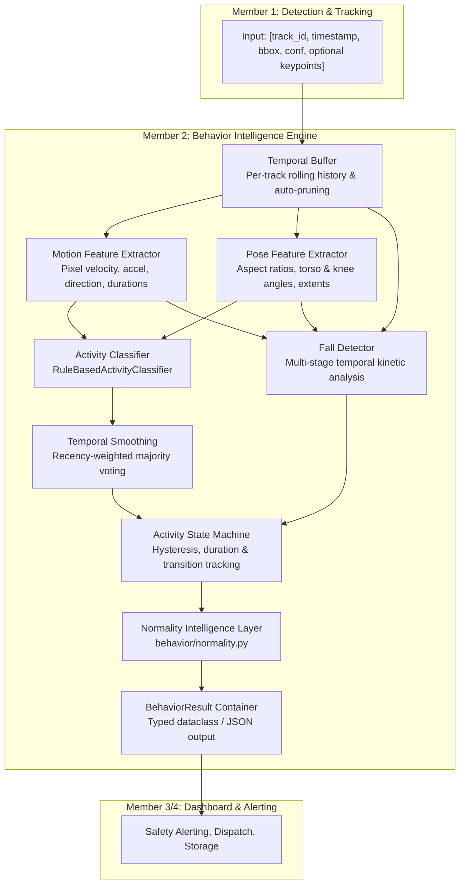

# Warehouse Sentinel - Behavior Intelligence Subsystem
**Member 2 Subsystem | HackNex 2026**

> Real-time, explainable human activity understanding, posture tracking, ergonomic risk assessment, and safety anomaly intelligence from continuous video surveillance.

---

## 📌 Executive Summary: What This Module Does

The **Behavior Intelligence Subsystem** serves as the cognitive reasoning core for **Warehouse Sentinel**. 

While upstream **Member 1 (Detection & Tracking)** detects people and tracks bounding boxes/poses frame-by-frame, and downstream **Member 3/4 (Dashboard & Alerting)** handles visualization and notification dispatch, **this subsystem (Member 2)** bridges the gap by answering three vital operational questions over time:
1. **WHAT is the person doing?** (Classifying actions such as walking, standing, sitting, crouching, bending, running, or falling).
2. **IS IT NORMAL OR ABNORMAL?** (Evaluating whether the action or its duration constitutes an operational, ergonomic, or emergency safety hazard in a warehouse).
3. **WHY?** (Providing deterministic, transparent evidence: velocities, joint angles, duration metrics, and kinematic transition sequences).

It operates completely **decoupled from YOLO and GPU hardware**—running entirely on CPU in $< 0.5$ ms per update, handling variable frame rates, missing frames, and occlusions gracefully.

---

## ⚡ Feature Summary at a Glance

| Feature Category | Capabilities & Implementation |
| :--- | :--- |
| **8 Activity Recognition Classes** | Deterministic, explainable classification of `STANDING`, `WALKING`, `RUNNING`, `SITTING`, `CROUCHING`, `BENDING`, `LYING`, and `FALLING` (plus `UNKNOWN` for low-confidence inputs). |
| **Normal vs. Abnormal Intelligence** | Decoupled normality layer classifying behavior into `NORMAL`, `POTENTIALLY_UNUSUAL`, or `ABNORMAL` based on activity type, duration, and sequence context. |
| **Ergonomic & Inactivity Monitoring** | Automatically flags sustained bending ($> 30$s, repetitive lifting risk), prolonged crouching ($> 30$s), and general inactivity ($> 60$s) with cautious, non-medical terminology. |
| **Multi-Stage Temporal Fall Detection** | Evaluates a 4-phase kinetic trajectory (rapid downward drop $\ge 40$ px/s $\to$ acceleration impact spike $\ge 30$ px/s² $\to$ aspect ratio collapse $\ge 1.4\times \to$ post-fall stillness). |
| **Post-Fall Sequence Reasoning** | Distinguishes ordinary intentional lying down (`NORMAL`) from critical fall consequences (`FALLING` $\to$ `LYING` $\to$ `ABNORMAL` / `HIGH` severity). |
| **Temporal Smoothing & Hysteresis** | Recency-weighted majority voting across sliding windows eliminates single-frame flicker and prevents duplicate transition alert flooding. |
| **Biomechanical Pose Analysis** | Vector angle calculations on COCO 17-keypoint skeletons (torso inclination, knee flexion, hip angles, and hip-to-ankle vertical drop ratio). |
| **Graceful Motion-Only Fallback** | Seamlessly falls back to bounding-box aspect ratios and kinematics when pose keypoints are missing or occluded. |
| **Independent Per-Track Buffering** | Independent rolling histories per track with automatic stale track eviction and bounded memory consumption. |
| **Zero YOLO / GPU Coupling** | Runs 100% offline without PyTorch or CUDA. Includes pure Python synthetic data generators for standalone development and testing. |
| **Automated Test & Simulation Suite** | **54 passing automated tests** (0.3s runtime), 7 standalone CLI simulations, and an OpenCV MP4 video generator. |

---

## 🏗️ Pipeline Architecture



---

## 📋 API Contracts & Interfaces

### 1. Input Contract (Member 1 $\to$ Member 2)

Member 1 feeds tracked bounding boxes and optional 17-keypoint COCO poses per person:

```python
from behavior.behavior_engine import BehaviorEngine

engine = BehaviorEngine("configs/behavior.yaml")

# Minimal Input (Motion-Only):
result = engine.update(
    track_id=7,
    timestamp=12.4,                     # Monotonic timestamp in seconds
    bbox=[100.0, 150.0, 160.0, 310.0],    # [x1, y1, x2, y2]
    detection_confidence=0.94           # [0.0 - 1.0]
)

# Preferred Input (Motion + Keypoints):
result = engine.update(
    track_id=7,
    timestamp=12.4,
    bbox=[100.0, 150.0, 160.0, 310.0],
    detection_confidence=0.94,
    keypoints=[
        [x0, y0, conf0],  # 0: nose
        [x1, y1, conf1],  # 1: left_eye
        # ... 17 COCO keypoints
        [x16, y16, conf16] # 16: right_ankle
    ]
)
```

---

### 2. Output Contract (Member 2 $\to$ Member 3/4)

The engine returns a strongly typed `BehaviorResult` (serializable via `result.to_dict()`):

#### Normal Activity Output:
```json
{
  "track_id": 7,
  "timestamp": 12.4,
  "activity": "WALKING",
  "status": "NORMAL",
  "severity": "NONE",
  "confidence": 0.92,
  "reason": null,
  "previous_activity": "STANDING",
  "duration": 4.8,
  "transition": {
    "from": "STANDING",
    "to": "WALKING",
    "timestamp": 12.4
  },
  "event": null
}
```

#### Potentially Unusual Ergonomic Risk:
```json
{
  "track_id": 4,
  "timestamp": 42.0,
  "activity": "BENDING",
  "status": "POTENTIALLY_UNUSUAL",
  "severity": "LOW",
  "confidence": 0.88,
  "reason": "Prolonged bending",
  "previous_activity": "WALKING",
  "duration": 42.0,
  "transition": null,
  "event": null
}
```

#### Critical Fall Incident Alert:
```json
{
  "track_id": 7,
  "timestamp": 52.7,
  "activity": "FALLING",
  "status": "ABNORMAL",
  "severity": "HIGH",
  "confidence": 0.94,
  "reason": "Possible fall detected",
  "previous_activity": "WALKING",
  "duration": 0.0,
  "transition": {
    "from": "WALKING",
    "to": "FALLING",
    "timestamp": 52.7
  },
  "event": {
    "type": "POSSIBLE_FALL",
    "track_id": 7,
    "timestamp": 52.7,
    "confidence": 0.94,
    "severity": "HIGH",
    "reason": [
      "rapid downward movement (60.0 px/s >= 40.0)",
      "impact acceleration spike (600.0 px/s² >= 30.0)",
      "posture transition to horizontal",
      "low post-fall movement"
    ]
  }
}
```

---

## 🏃 Activity Classes & Postural Discriminators

| Activity | Kinematic & Posture Profile | Key Discriminator |
| :--- | :--- | :--- |
| **`STANDING`** | Upright torso ($< 35^\circ$), straight legs ($> 135^\circ$), low velocity ($\le 8$ px/s). | Distinguishable from sitting/crouching via straight knee angles. |
| **`WALKING`** | Upright posture, moderate velocity ($6 - 28$ px/s). | Continuous directional displacement. |
| **`RUNNING`** | Upright posture, high velocity ($> 26$ px/s), acceleration bursts ($> 15$ px/s²). | Sustained high pixel velocity and trajectory variance. |
| **`SITTING`** | Upright torso ($< 35^\circ$), bent knees ($< 135^\circ$), low velocity ($\le 8$ px/s). | Hips elevated at chair height ($> 0.35$ vertical extent). |
| **`CROUCHING`** | Low velocity, deep knee flexion ($< 115^\circ$), hips dropped near ankles ($\le 0.35$ vertical extent). | Deep squatting posture, distinguishable from sitting by low hip height. |
| **`BENDING`** | Low velocity, forward-tilted torso ($35^\circ - 75^\circ$ from vertical), straight legs ($> 130^\circ$). | Stooping at the waist for lifting/inspection while standing on feet. |
| **`LYING`** | Horizontal body orientation ($W/H > 1.15$, torso angle $> 60^\circ$), low velocity ($\le 6$ px/s). | Horizontally recumbent across floor without rapid descent spike. |
| **`FALLING`** | Standing/Walking $\to$ downward velocity spike $\to$ impact $\to$ horizontal stillness. | Multi-stage temporal sequence evaluated by FallDetector. |
| **`UNKNOWN`** | Low detection confidence ($< 0.45$), occlusion, or ambiguous cues. | Prevents false positives under degraded sensor quality. |

---

## 🛡️ Normality Intelligence Layer (`behavior/normality.py`)

Activities themselves are not inherently abnormal. The normality layer evaluates whether a posture is acceptable or concerning:

| Activity | Condition | Status | Severity | Reason |
| :--- | :--- | :--- | :--- | :--- |
| **`STANDING`** | Any duration | `NORMAL` | `NONE` | `None` |
| **`WALKING`** | Any duration | `NORMAL` | `NONE` | `None` |
| **`RUNNING`** | Default policy | `NORMAL` | `NONE` | `None` |
| **`SITTING`** | Any duration | `NORMAL` | `NONE` | `None` |
| **`BENDING`** | $\le 30.0$s | `NORMAL` | `NONE` | `None` |
| **`BENDING`** | $> 30.0$s | `POTENTIALLY_UNUSUAL` | `LOW` | `"Prolonged bending"` |
| **`CROUCHING`** | $\le 30.0$s | `NORMAL` | `NONE` | `None` |
| **`CROUCHING`** | $> 30.0$s | `POTENTIALLY_UNUSUAL` | `LOW` | `"Prolonged crouching"` |
| **`LYING`** | $\le 30.0$s (no fall) | `NORMAL` | `NONE` | `None` |
| **`LYING`** | $> 30.0$s (no fall) | `POTENTIALLY_UNUSUAL` | `LOW` | `"Prolonged lying"` |
| **`FALLING`** | Any fall detection | `ABNORMAL` | `HIGH` | `"Possible fall detected"` |
| **`LYING`** | **Following a fall** | `ABNORMAL` | `HIGH` | `"Lying following a fall"` |
| **`UNKNOWN`** | Low confidence | `UNKNOWN` | `NONE` | `None` |

---

## 📉 Multi-Stage Fall Detection Logic

A fall is **never** triggered simply because a person is lying down (intentional resting is normal). Genuine falls exhibit a distinct 4-stage temporal signature:

```text
STANDING / WALKING
       ↓
Rapid Downward Displacement (vy >= 40.0 px/s)
       ↓
Impact & Acceleration Spike (a >= 30.0 px/s²)
       ↓
Posture Collapse to Horizontal (Aspect ratio flip >= 1.4x)
       ↓
Post-Fall Stillness / Lying Motionless (v <= 8.0 px/s)
```

The `FallDetector` computes a composite score:
$$\text{fall\_score} = 0.35 \cdot s_{\text{vertical}} + 0.25 \cdot s_{\text{posture}} + 0.20 \cdot s_{\text{accel}} + 0.20 \cdot s_{\text{stability}}$$

- $\text{fall\_score} \ge 0.82 \implies \textbf{FALL\_DETECTED}$ (Severity: `CRITICAL`)
- $\text{fall\_score} \ge 0.60 \implies \textbf{POSSIBLE\_FALL}$ (Severity: `HIGH`)
- Cooldown timer (5.0s) prevents repeated alerts for the same event.

---

## ⚙️ Configuration Reference (`configs/behavior.yaml`)

All operational thresholds are externalized in `configs/behavior.yaml`:

```yaml
history:
  max_seconds: 5.0
  stale_track_seconds: 2.0
  max_frames: 150

motion:
  standing:
    max_velocity: 8.0
  walking:
    min_velocity: 6.0
    max_velocity: 28.0
  running:
    min_velocity: 26.0
    min_acceleration: 15.0
  prolonged_inactivity_seconds: 60.0

pose:
  min_keypoint_confidence: 0.35
  lying_aspect_ratio_min: 1.15
  standing_aspect_ratio_max: 0.75
  torso_upright_max_deg: 35.0
  torso_horizontal_min_deg: 60.0
  sitting_knee_angle_max: 135.0
  crouching_knee_angle_max: 115.0
  crouching_hip_ankle_dy_ratio: 0.35
  bending_torso_angle_min: 35.0
  bending_torso_angle_max: 75.0
  bending_knee_angle_min: 130.0

smoothing:
  window_size: 7
  min_duration_seconds: 0.40
  recency_weight_decay: 0.85

fall_detection:
  detection_window_seconds: 2.5
  min_downward_velocity: 40.0
  min_downward_acceleration: 30.0
  posture_change_ratio_min: 1.40
  post_fall_velocity_max: 8.0
  possible_fall_threshold: 0.60
  fall_detected_threshold: 0.82
  cooldown_seconds: 5.0

normality:
  prolonged_bending_seconds: 30.0
  prolonged_crouching_seconds: 30.0
  prolonged_lying_seconds: 30.0
```

---

## 🧪 Testing & Simulation Commands

### 1. Run Automated Test Suite
```bash
python -m pytest tests/ -v
```
**54 passing tests** verifying:
- Temporal buffer independence, pruning, and timestamp handling
- Motion kinematics (velocity, acceleration, direction, durations)
- Pose analyzer geometry and missing-keypoint fallbacks
- Activity classification rules (all 8 classes)
- Temporal smoothing and flicker filtering
- State machine transitions and inactivity
- Fall detector temporal sequence validation
- Normality classification rules and fall-lying sequences
- All 12 end-to-end specification scenarios

### 2. Run Standalone CLI Simulations
```bash
# 1. Normal vs Abnormal behavior showcase
python examples/simulate_normality.py

# 2. Fall detection and alert generation
python examples/simulate_fall.py

# 3. Individual posture simulations
python examples/simulate_walking.py
python examples/simulate_running.py
python examples/simulate_sitting.py
python examples/simulate_crouching.py
python examples/simulate_bending.py

# 4. Multi-person concurrent tracking demonstration
python examples/demo_behavior_engine.py

# 5. Visual MP4 video generator (renders output/warehouse_simulation.mp4)
python examples/render_simulation_video.py
```

---

## 🤝 Member 1 + Member 2 Integration (Implemented & Operational)

Member 1 (`autonomous-vision` — YOLO11 & ByteTrack) and Member 2 (`behavior` — Behavior Intelligence Engine) are fully integrated into a unified end-to-end video pipeline.

### 1. Run the Integrated Sentinel Pipeline (Recommended)

Run the unified orchestrator on any warehouse video file:

```powershell
python run_sentinel.py --input autonomous-vision/data/input/multi_person.mp4 --output output/integrated_multi_person.mp4 --json-output output/integrated_telemetry.json
```

**What it does:**
1. Tracks people using YOLO11n + ByteTrack with persistent track IDs.
2. Evaluates kinematics, 8 activity classes, fall sequences, and ergonomics per track.
3. Renders a combined video HUD with track IDs, activity labels, normality status badges (`NORMAL`, `POTENTIALLY_UNUSUAL`, `ABNORMAL`), velocity tags, and flashing alert banners.
4. Exports comprehensive JSON telemetry combining tracking metadata and full behavioral records/events for Member 3/4.

---

### 2. Run Member 1 Native Tracker with Behavior Intelligence

Member 1's native CLI also directly supports behavior intelligence via the `--with-behavior` flag:

```powershell
python -m detection.tracker --input data/input/multi_person.mp4 --with-behavior
```

---

### 3. Programmatic Usage (`SentinelPipeline`)

```python
from pipeline.sentinel_pipeline import SentinelPipeline

pipeline = SentinelPipeline(
    model_path="autonomous-vision/models/yolo11n.pt",
    behavior_config="configs/behavior.yaml",
    conf_threshold=0.25,
)

# Process video file end-to-end:
summary = pipeline.process_video(
    input_path="autonomous-vision/data/input/multi_person.mp4",
    output_video_path="output/annotated.mp4",
    json_output_path="output/telemetry.json",
)

# Or stream frame-by-frame for real-time dashboards (Member 3/4):
for frame_num, timestamp, annotated_frame, records, events in pipeline.stream_video("video.mp4"):
    # annotated_frame: BGR numpy image with complete HUD
    # records: List of track dicts enriched with record["behavior"]
    # events: List of safety hazard events triggered on this frame
    pass
```

---

### 4. Comprehensive Test Suite (79 Passing Tests)

```powershell
# Run Behavior Intelligence & Integration tests (60 tests)
python -m pytest tests/ -v

# Run Member 1 Detection & Tracking tests (19 tests)
$env:PYTHONPATH="autonomous-vision"; python -m unittest discover -s autonomous-vision/tests -p "test_*.py" -v
```

---

## 🔮 Future ML / Deep Learning Compatibility

The subsystem provides an abstract interface:

```python
class ActivityClassifier(ABC):
    @abstractmethod
    def predict(self, motion: MotionFeatures, pose: PoseFeatures, detection_confidence: float) -> ActivityPrediction:
        pass
```

To incorporate an LSTM, GRU, or Temporal Convolutional Network (TCN):
1. Subclass `ActivityClassifier` (e.g. `LSTMActivityClassifier`).
2. Pass the classifier instance to `BehaviorEngine(classifier=LSTMActivityClassifier(model_path))`.
3. The temporal buffers, smoothing, state machine, fall detector, normality layer, and event handlers remain unchanged without code modifications.
